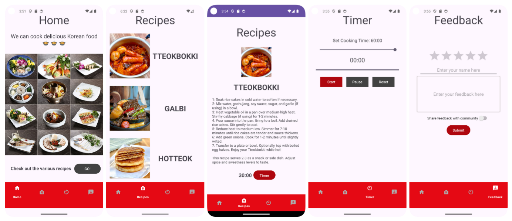

# 🍽️ Cooking Class App

> A mobile app that helps users explore recipes, set timers, and provide feedback on their cooking experience.
<br>

## 🚀 Features
- 🏠 **Home Screen (MainActivity)**: The starting point of the app.
- 📜 **Recipe List (RecipesActivity)**: Browse a collection of recipes.
- 📖 **Recipe Details (DetailActivity)**: View detailed recipes, including cooking instructions and a timer.
- ⏳ **Cooking Timer (TimerActivity)**: Automatically set a pre-configured timer or adjust it manually. Includes pause and reset functionality.
- ⭐ **User Feedback (FeedbackActivity)**: Rate the app and submit feedback (Backend integration in progress).
<br>

## 📖 How to Use
1. Open the app and navigate through the **Home Screen (MainActivity)**.
2. Go to **RecipesActivity** to browse the list of available recipes.
3. Tap on a recipe to open **DetailActivity**, where you can view detailed cooking instructions.
4. Click on the **Timer** button to launch **TimerActivity**, where a pre-set time is loaded. You can also manually adjust the timer and use **pause/reset** functions.
5. Navigate to **FeedbackActivity** to rate the app and submit feedback (Backend functionality coming soon).
<br>

## 🖼️ Screenshots

<br><br>

## 📂 Project Structure
```plaintext
main/                         # Source code for the application
├── activities/               # Contains all Activity files
│   ├── MainActivity.java     # Home screen
│   ├── RecipesActivity.java  # Displays the list of recipes
│   ├── DetailActivity.java   # Shows detailed recipe info
│   ├── TimerActivity.java    # Cooking timer with pause/reset features
│   ├── FeedbackActivity.java # User rating and feedback form
├── res/                      # App resources (layouts, images, etc.)
│   ├── layout/               # XML layout files for each activity
│   ├── drawable/             # Images and icons
│   ├── values/               # XML files for colors, strings, and themes
├── AndroidManifest.xml       # App configuration file
README.md                     # Project documentation
```
<br>

## 🛠️ Tech Stack
- Android (Java)
- XML (UI Layouts)
<br>

## 📞 Contact
- Author: Soso Kim
- GitHub: https://github.com/yakongs
- Email: rtgm1215@gmail.com
